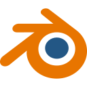
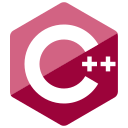
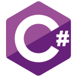
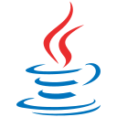
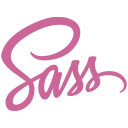
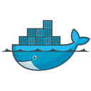
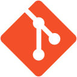
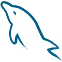
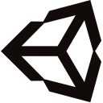

# Hi there 👋

## 📫 How to reach me

## 🌱 I’m currently learning
&nbsp; &nbsp;
Through development of my website [jasonwoitalla.com](jasonwoitalla.com) I'm gaining vital experience with react.
  
&nbsp; &nbsp;
I'm exploring my interest in 3D environments by learning blender. Stay tuned for updates on this journey though my progress repo.

## 💻 Programming Languages

 

## 🔨 Tools

<!--
**jasonwoitalla/jasonwoitalla** is a ✨ _special_ ✨ repository because its `README.md` (this file) appears on your GitHub profile.

Here are some ideas to get you started:

- 🔭 I’m currently working on ...
- 🌱 I’m currently learning ...
- 👯 I’m looking to collaborate on ...
- 🤔 I’m looking for help with ...
- 💬 Ask me about ...
- 📫 How to reach me: ...
- 😄 Pronouns: ...
- ⚡ Fun fact: ...
-->
